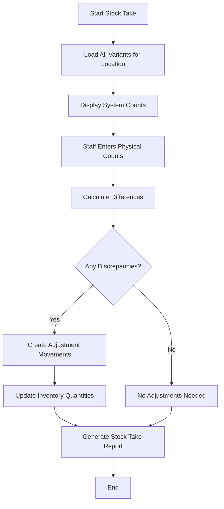

## Overview

Stock take (also called physical inventory count) is the process of manually counting all products in a location and comparing the physical count with the system records. ShelfWise makes this process efficient with a dedicated interface and automatic reconciliation.

## When to Conduct Stock Take

<Tabs>
  <Tab title="Regular Schedule">
    - **Monthly**: For high-value or fast-moving inventory
    - **Quarterly**: For standard retail operations
    - **Annually**: Minimum requirement for financial reporting
    - **Year-end**: Required for accurate financial statements
  </Tab>
  <Tab title="Triggered Events">
    - After detecting significant discrepancies
    - Following suspected theft or loss
    - During staff transitions or management changes
    - After system migrations or data imports
    - Before/after major sales events (Black Friday, etc.)
  </Tab>
  <Tab title="Compliance">
    - Pharmaceutical shops: Often required monthly or quarterly
    - Food businesses: Health inspections may require regular counts
    - Tax audits: Accurate inventory values are critical
  </Tab>
</Tabs>

## Stock Take Workflow

The stock take process in ShelfWise follows these steps:



## Stock Take Controller

Implemented in `app/Http/Controllers/StockTakeController.php`:

### View Stock Take Page

```php
// app/Http/Controllers/StockTakeController.php:24-64

// Navigate to: /shops/{shop}/stock-take

public function index(Shop $shop): Response
{
    Gate::authorize('manage', $shop);
    
    $variants = ProductVariant::whereHas('product', function ($query) use ($shop) {
        $query->where('shop_id', $shop->id)
            ->where('is_active', true);
    })
    ->with('inventoryLocations')
    ->orderBy('sku')
    ->get();
    
    // Returns data for each variant:
    // - SKU
    // - Product name
    // - System count (current quantity in system)
    // - Physical count (empty, to be filled by user)
    // - Location ID
}
```

<Note>
Only active products are included in stock take to avoid counting discontinued items.
</Note>

### Submit Stock Take

```php
// app/Http/Controllers/StockTakeController.php:66-132

public function store(Request $request, Shop $shop): RedirectResponse
{
    $validated = $request->validate([
        'counts' => 'required|array',
        'counts.*.variant_id' => 'required|exists:product_variants,id',
        'counts.*.location_id' => 'required|exists:inventory_locations,id',
        'counts.*.physical_count' => 'required|integer|min:0',
        'counts.*.system_count' => 'required|integer',
        'notes' => 'nullable|string|max:1000',
    ]);
    
    // For each variant with a discrepancy:
    // 1. Calculate difference (physical - system)
    // 2. Determine adjustment type (IN or OUT)
    // 3. Call StockMovementService.adjustStock()
    // 4. Record movement with reason and notes
}
```

## Stock Take in StockMovementService

The core logic is in `app/Services/StockMovementService.php:404-472`:

```php
use App\Services\StockMovementService;

$movement = app(StockMovementService::class)->stockTake(
    variant: $variant,
    location: $inventoryLocation,
    actualQuantity: 95,
    user: auth()->user(),
    notes: 'Monthly stock take - January 2024'
);

// Returns:
// - StockMovement if adjustment was made
// - null if physical count matches system count
```

### How It Works

<Steps>
  <Step title="Compare Counts">
    Calculate difference between physical count and system count:
    ```php
    $quantityBefore = $location->quantity;  // System: 100
    $actualQuantity = 95;                   // Physical: 95
    $difference = $actualQuantity - $quantityBefore; // -5
    ```
  </Step>
  
  <Step title="Check if Adjustment Needed">
    If difference is zero, no adjustment is needed:
    ```php
    if ($difference === 0) {
        return null; // No movement created
    }
    ```
  </Step>
  
  <Step title="Update Location Quantity">
    Set quantity to the actual physical count:
    ```php
    $location->quantity = $actualQuantity; // Set to 95
    $location->save();
    ```
  </Step>
  
  <Step title="Create Movement Record">
    Create a STOCK_TAKE movement with full audit trail:
    ```php
    StockMovement::create([
        'type' => StockMovementType::STOCK_TAKE,
        'quantity' => abs($difference),        // 5 (always positive)
        'quantity_before' => $quantityBefore,  // 100
        'quantity_after' => $actualQuantity,   // 95
        'reason' => $difference > 0 
            ? 'Stock take - surplus found'
            : 'Stock take - shortage found',
        'reference_number' => 'STK-01HQXXX...',
    ]);
    ```
  </Step>
  
  <Step title="Clear Reorder Alert Cache">
    Refresh reorder alerts to reflect new quantities:
    ```php
    $this->reorderAlertService->clearCache($user->tenant, null);
    ```
  </Step>
</Steps>

## Stock Take UI Example

A typical stock take interface looks like this:

<CodeGroup>
```typescript React Component
import { useState } from 'react';
import { useForm } from '@inertiajs/react';

interface StockTakeItem {
  variant_id: number;
  location_id: number;
  sku: string;
  product_name: string;
  system_count: number;
  physical_count: number | null;
}

export default function StockTake({ shop, variants }) {
  const { data, setData, post, processing } = useForm({
    counts: variants,
    notes: '',
  });

  const updatePhysicalCount = (index: number, value: number) => {
    const updated = [...data.counts];
    updated[index].physical_count = value;
    setData('counts', updated);
  };

  const handleSubmit = (e) => {
    e.preventDefault();
    post(route('shops.stock-take.store', shop.id));
  };

  const calculateDifference = (item: StockTakeItem) => {
    if (item.physical_count === null) return null;
    return item.physical_count - item.system_count;
  };

  return (
    <form onSubmit={handleSubmit}>
      <table>
        <thead>
          <tr>
            <th>SKU</th>
            <th>Product</th>
            <th>System Count</th>
            <th>Physical Count</th>
            <th>Difference</th>
          </tr>
        </thead>
        <tbody>
          {data.counts.map((item, index) => {
            const diff = calculateDifference(item);
            return (
              <tr key={item.variant_id}>
                <td>{item.sku}</td>
                <td>{item.product_name}</td>
                <td>{item.system_count}</td>
                <td>
                  <input
                    type="number"
                    min="0"
                    value={item.physical_count ?? ''}
                    onChange={(e) => updatePhysicalCount(index, parseInt(e.target.value))}
                  />
                </td>
                <td className={diff && diff !== 0 ? 'text-red-600' : ''}>
                  {diff !== null ? (diff > 0 ? `+${diff}` : diff) : '-'}
                </td>
              </tr>
            );
          })}
        </tbody>
      </table>
      
      <textarea
        placeholder="Notes (optional)"
        value={data.notes}
        onChange={(e) => setData('notes', e.target.value)}
      />
      
      <button type="submit" disabled={processing}>
        Complete Stock Take
      </button>
    </form>
  );
}
```
</CodeGroup>

## Stock Take Reports

After completing a stock take, ShelfWise provides a summary:

<ResponseField name="adjustments_made" type="integer">
  Number of variants that required adjustment
</ResponseField>

<ResponseField name="total_variants" type="integer">
  Total variants counted
</ResponseField>

<ResponseField name="total_shortage" type="integer">
  Total units missing (system count > physical count)
</ResponseField>

<ResponseField name="total_surplus" type="integer">
  Total extra units found (physical count > system count)
</ResponseField>

<ResponseField name="movements" type="array">
  List of all adjustment movements created:
  - Variant SKU
  - Difference (positive or negative)
  - Movement reference number
</ResponseField>

## Example Stock Take Scenarios

### Scenario 1: Missing Inventory

```php
// System shows: 100 units
// Physical count: 95 units
// Difference: -5 units (shortage)

$movement = app(StockMovementService::class)->stockTake(
    variant: $variant,
    location: $location,
    actualQuantity: 95,
    user: auth()->user(),
    notes: 'Monthly stock take - 5 units missing, suspected theft'
);

// Creates movement:
// Type: STOCK_TAKE
// Quantity: 5
// Before: 100
// After: 95
// Reason: "Stock take - shortage found"
```

### Scenario 2: Found Inventory

```php
// System shows: 50 units
// Physical count: 65 units
// Difference: +15 units (surplus)

$movement = app(StockMovementService::class)->stockTake(
    variant: $variant,
    location: $location,
    actualQuantity: 65,
    user: auth()->user(),
    notes: 'Found 15 units in back storage room'
);

// Creates movement:
// Type: STOCK_TAKE
// Quantity: 15
// Before: 50
// After: 65
// Reason: "Stock take - surplus found"
```

### Scenario 3: Counts Match

```php
// System shows: 200 units
// Physical count: 200 units
// Difference: 0 units (match)

$movement = app(StockMovementService::class)->stockTake(
    variant: $variant,
    location: $location,
    actualQuantity: 200,
    user: auth()->user(),
    notes: 'Monthly stock take - all counts match'
);

// Returns: null (no movement created)
// No adjustment needed
```

## Batch Stock Take

For large inventories, process all variants in a single transaction:

```php
// app/Http/Controllers/StockTakeController.php:82-118

use Illuminate\Support\Facades\DB;

DB::transaction(function () use ($counts, $shop) {
    foreach ($counts as $count) {
        $variant = ProductVariant::findOrFail($count['variant_id']);
        $location = InventoryLocation::findOrFail($count['location_id']);
        
        $difference = $count['physical_count'] - $count['system_count'];
        
        if ($difference !== 0) {
            $quantity = abs($difference);
            $type = $difference > 0
                ? StockMovementType::ADJUSTMENT_IN
                : StockMovementType::ADJUSTMENT_OUT;
            
            app(StockMovementService::class)->adjustStock(
                variant: $variant,
                location: $location,
                quantity: $quantity,
                type: $type,
                user: auth()->user(),
                reason: "Stock take adjustment - Physical: {$count['physical_count']}, System: {$count['system_count']}",
                notes: $notes
            );
        }
    }
});
```

<Warning>
Batch stock takes run in a single database transaction. If any adjustment fails, all changes are rolled back.
</Warning>

## Variance Analysis

Track patterns in stock discrepancies:

```php
// Find variants with frequent discrepancies
$frequentVariances = StockMovement::query()
    ->where('tenant_id', $tenantId)
    ->where('type', StockMovementType::STOCK_TAKE)
    ->where('created_at', '>=', now()->subMonths(3))
    ->select('product_variant_id', DB::raw('COUNT(*) as count'))
    ->groupBy('product_variant_id')
    ->having('count', '>=', 3)
    ->with('productVariant.product')
    ->get();

// These variants may have:
// - Theft issues
// - Counting errors
// - Spoilage/damage not being recorded
// - System bugs
```

## Best Practices

<Tabs>
  <Tab title="Preparation">
    - Schedule during low-traffic times (early morning, after closing)
    - Assign specific zones to staff members
    - Print or display SKU lists organized by shelf location
    - Ensure good lighting and clear signage
    - Have backup staff available for verification
  </Tab>
  <Tab title="Accuracy">
    - Count twice for high-value items
    - Use barcode scanners to reduce manual entry errors
    - Verify units (boxes vs. individual items)
    - Check expiry dates while counting (remove expired stock)
    - Look in all storage areas (back room, displays, locked cabinets)
  </Tab>
  <Tab title="Investigation">
    - Large discrepancies (>10%) require investigation
    - Document possible causes in notes field
    - Review recent sales and deliveries
    - Check for mis-scanned items at POS
    - Review access logs for suspected theft
  </Tab>
  <Tab title="Follow-up">
    - Update reorder levels if needed
    - Tighten controls for high-variance items
    - Train staff on proper recording procedures
    - Consider more frequent counts for problem items
    - Review security measures if theft is suspected
  </Tab>
</Tabs>

## Authorization

<Note>
Stock take requires `manage` permission on the shop:
```php
Gate::authorize('manage', $shop);
```

Typically allowed for:
- Shop Manager and above
- Inventory Clerk (if specifically granted)
- Owner and General Manager
</Note>

## Multi-Tenant Isolation

<Warning>
**CRITICAL**: All stock take operations MUST be scoped to tenant
</Warning>

```php
// ✅ CORRECT
$variants = ProductVariant::whereHas('product', function ($query) use ($shop, $tenantId) {
    $query->where('tenant_id', $tenantId)
        ->where('shop_id', $shop->id);
})->get();

// ❌ WRONG - Missing tenant check
$variants = ProductVariant::whereHas('product', function ($query) use ($shop) {
    $query->where('shop_id', $shop->id);
})->get();
```

## Related Features

- [Stock Movements](/features/inventory/stock-movements) - View adjustment history
- [Products & Variants](/features/inventory/products) - Manage inventory items
- [Reorder Alerts](/features/inventory/reorder-alerts) - Monitor stock levels