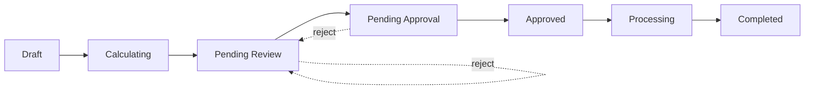

ShelfWise provides a comprehensive payroll management system designed for Nigerian businesses. The system handles employee compensation, statutory deductions, tax calculations, and bank file generation for seamless salary disbursement.

## Key Features

- **Modern Pay Run Workflow** - Draft → Calculate → Review → Approve → Complete
- **Automatic Tax Calculations** - NTA 2025 tax law support with date-aware calculations
- **Statutory Deductions** - Pension, NHF, NHIS, and PAYE tax
- **Wage Advances** - Employee salary advances with automatic repayment tracking
- **NIBSS Export** - Generate bank-ready files for salary disbursement
- **Year-to-Date Tracking** - Automatic YTD calculations for compliance reporting
- **Multi-Tenant Isolation** - Complete data separation between organizations

## Payroll Architecture

### Legacy vs Modern System

<Note>
The system uses **PayRunService** for all new payroll processing. The legacy `PayrollService` is deprecated and will be removed in v2.0.
</Note>

```php
app/Services/PayRunService.php       // Modern service (use this)
app/Services/PayrollService.php      // Deprecated since v1.5.0
app/Services/TaxCalculationService.php  // Date-aware tax engine
app/Services/DeductionsService.php   // Deduction calculations
app/Services/EarningsService.php     // Earnings calculations
app/Services/NibssExportService.php  // Bank file generation
```

### Core Models

<Steps>
  <Step title="PayrollPeriod">
    Defines the time period for payroll (e.g., "January 2026"). Contains start date, end date, and payment date.
  </Step>
  
  <Step title="PayRun">
    The modern payroll calculation workflow. Each period can have multiple pay runs (e.g., for different departments or correction runs).
  </Step>
  
  <Step title="PayRunItem">
    Individual employee record within a pay run. Tracks calculation status and stores computed earnings/deductions.
  </Step>
  
  <Step title="Payslip">
    Final employee payment record generated when a pay run is completed. Immutable after creation.
  </Step>
</Steps>

## Pay Run Workflow

The modern payroll system uses a structured workflow with clear status transitions:



### Status Descriptions

<Accordion title="Draft">
Initial state. Employees can be added/removed. No calculations performed yet.
</Accordion>

<Accordion title="Calculating">
System is computing earnings, deductions, and taxes for all employees. Automatic transition.
</Accordion>

<Accordion title="Pending Review">
Calculations complete. Payroll manager reviews amounts and can recalculate individual items if needed.
</Accordion>

<Accordion title="Pending Approval">
Submitted for approval. Requires manager/owner authorization before proceeding.
</Accordion>

<Accordion title="Approved">
Authorized for payment. Ready to generate payslips and export bank files.
</Accordion>

<Accordion title="Processing">
Generating final payslips and recording all transactions. Automatic transition.
</Accordion>

<Accordion title="Completed">
Payslips generated. Employees can view their payslips. NIBSS file can be downloaded.
</Accordion>

## Creating a Pay Run

```php
use App\Services\PayRunService;
use Carbon\Carbon;

class PayrollController extends Controller
{
    public function __construct(
        protected PayRunService $payRunService
    ) {}

    public function createPayRun(Request $request)
    {
        Gate::authorize('create', PayRun::class);

        // Create payroll period
        $period = $this->payRunService->createPayrollPeriod(
            tenantId: auth()->user()->tenant_id,
            shopId: $request->shop_id,
            startDate: Carbon::parse($request->start_date),
            endDate: Carbon::parse($request->end_date),
            paymentDate: Carbon::parse($request->payment_date),
            periodName: $request->period_name
        );

        // Create pay run
        $payRun = $this->payRunService->createPayRun(
            tenantId: auth()->user()->tenant_id,
            period: $period,
            options: [
                'name' => "Pay Run - {$period->period_name}",
                'shop_ids' => $request->shop_ids,
                'notes' => $request->notes,
            ]
        );

        return redirect()->route('pay-runs.show', $payRun);
    }
}
```

## Calculating Payroll

The calculation process computes all earnings, deductions, and taxes:

```php
// Calculate entire pay run
$payRun = $this->payRunService->calculatePayRun($payRun);

// Recalculate single employee
$item = $payRun->items()->where('user_id', $employeeId)->first();
$item = $this->payRunService->recalculateItem($item);
```

### Calculation Flow

<Steps>
  <Step title="Calculate Earnings">
    Compute base salary, hourly/daily pay, overtime, commissions, and bonuses using `EarningsService`.
  </Step>
  
  <Step title="Calculate Deductions">
    Apply pension, NHF, NHIS, wage advance repayments, and custom deductions via `DeductionsService`.
  </Step>
  
  <Step title="Calculate Tax">
    Use `TaxCalculationService` to compute PAYE tax based on NTA 2025 tax law (date-aware).
  </Step>
  
  <Step title="Compute Net Pay">
    Net Pay = Gross Earnings - Total Deductions - PAYE Tax
  </Step>
</Steps>

<Warning>
Always use the modern `PayRunService` for new implementations. The legacy `PayrollService` does not support NTA 2025 tax calculations and lacks YTD tracking.
</Warning>

## Tax Calculation

The system uses date-aware tax calculations to support multiple tax law versions:

```php
use App\Services\TaxCalculationService;

$taxResult = $this->taxService->calculateMonthlyPAYE(
    employee: $employee,
    grossIncome: $earnings['total_taxable'],
    preTaxDeductions: $deductions['total_pre_tax'],
    reliefs: [],
    payDate: $periodEnd  // Tax law version determined by date
);

// Returns:
[
    'tax' => 45000.00,
    'effective_rate' => 15.5,
    'taxable_income' => 290000.00,
    'tax_law_version' => 'NTA_2025',
    'breakdown' => [...]
]
```

## Approval & Completion

```php
// Submit for approval
$payRun = $this->payRunService->submitForApproval($payRun);

// Approve
$payRun = $this->payRunService->approvePayRun($payRun);

// Complete (generates payslips)
$payRun = $this->payRunService->completePayRun($payRun);
```

When a pay run is completed:
- Final **Payslip** records are created for each employee
- **Year-to-Date** totals are updated
- **Wage advance repayments** are recorded
- **Deduction balances** are updated
- Employees receive **notifications** with payment details

## Year-to-Date Tracking

Payslips automatically track cumulative values for the tax year (January 1 - December 31):

```php
app/Services/PayRunService.php:596-624

protected function calculateYTDValues(int $userId, Carbon $periodEnd): array
{
    $taxYearStart = $this->getTaxYearStart($periodEnd);
    
    $ytdData = Payslip::where('user_id', $userId)
        ->where('tenant_id', $tenantId)
        ->whereHas('payrollPeriod', function ($query) use ($taxYearStart, $periodEnd) {
            $query->where('payment_date', '>=', $taxYearStart)
                ->where('payment_date', '<', $periodEnd);
        })
        ->where('status', '!=', 'cancelled')
        ->selectRaw('
            COALESCE(SUM(gross_pay), 0) as ytd_gross,
            COALESCE(SUM(income_tax), 0) as ytd_tax,
            COALESCE(SUM(pension_employee), 0) as ytd_pension,
            COALESCE(SUM(net_pay), 0) as ytd_net
        ')
        ->first();
    
    return [
        'ytd_gross' => (float) ($ytdData->ytd_gross ?? 0),
        'ytd_tax' => (float) ($ytdData->ytd_tax ?? 0),
        'ytd_pension' => (float) ($ytdData->ytd_pension ?? 0),
        'ytd_net' => (float) ($ytdData->ytd_net ?? 0),
    ];
}
```

## Statutory Deductions

ShelfWise automatically handles Nigerian statutory deductions:

<ParamField body="Pension" type="percentage" required>
  Employee: 8% of gross salary  
  Employer: 10% of gross salary  
  Configurable per employee in payroll settings
</ParamField>

<ParamField body="NHF" type="percentage" required>
  National Housing Fund: 2.5% of basic salary  
  Can be disabled per employee
</ParamField>

<ParamField body="NHIS" type="fixed" required>
  National Health Insurance Scheme  
  Fixed amount per employee (configurable)
</ParamField>

<ParamField body="PAYE" type="progressive" required>
  Pay As You Earn income tax  
  Calculated using progressive tax bands (NTA 2025)
</ParamField>

## Next Steps

<CardGroup cols={2}>
  <Card title="Pay Runs" icon="calculator" href="/features/payroll/pay-runs">
    Learn about the complete pay run workflow and calculations
  </Card>
  
  <Card title="Wage Advances" icon="money-bill-transfer" href="/features/payroll/wage-advances">
    Manage employee salary advances with automatic repayment
  </Card>
  
  <Card title="Deductions" icon="minus-circle" href="/features/payroll/deductions">
    Configure deduction types and manage employee deductions
  </Card>
</CardGroup>