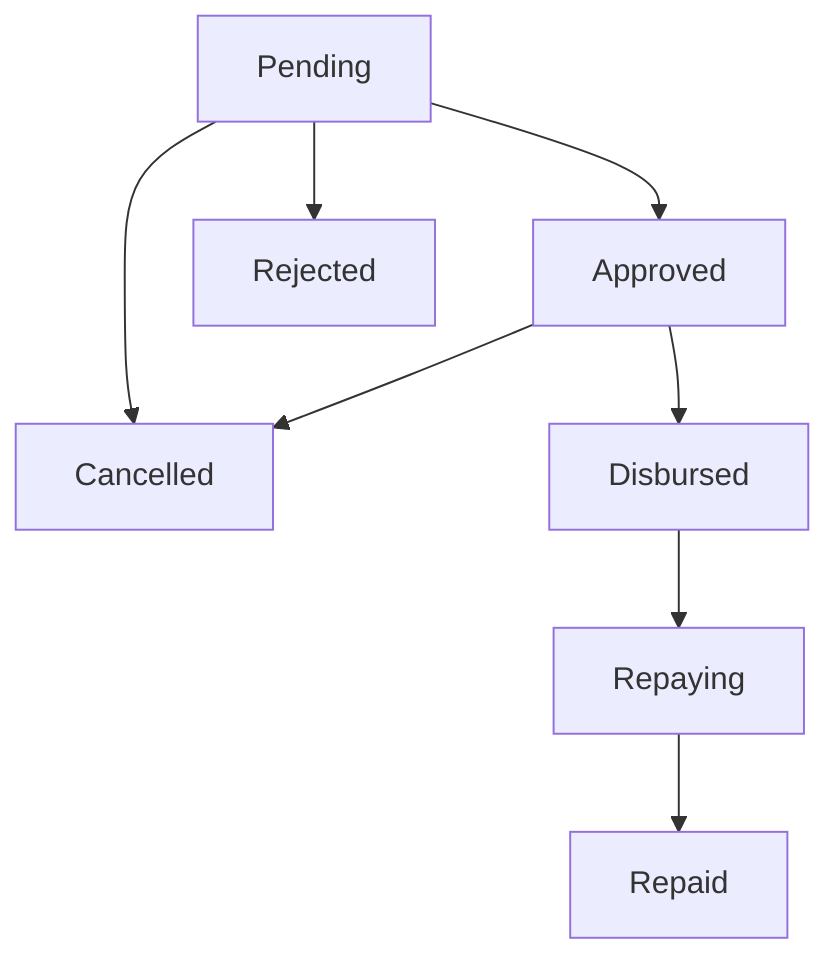

Wage advances allow employees to request early payment of their salary. The system tracks the advance amount, repayment installments, and automatically deducts repayments from future payslips.

## Wage Advance Model

```php
app/Models/WageAdvance.php

class WageAdvance extends Model
{
    protected $fillable = [
        'user_id',
        'shop_id',
        'tenant_id',
        'amount_requested',
        'amount_approved',
        'status',                    // WageAdvanceStatus enum
        'reason',
        'requested_at',
        'approved_by_user_id',
        'approved_at',
        'rejection_reason',
        'disbursed_by_user_id',
        'disbursed_at',
        'repayment_start_date',
        'repayment_installments',    // Number of payroll periods
        'amount_repaid',
        'fully_repaid_at',
        'notes',
    ];
}
```

## Wage Advance Status Flow

Wage advances progress through seven possible statuses:

```php
app/Enums/WageAdvanceStatus.php

enum WageAdvanceStatus: string
{
    case PENDING = 'pending';
    case APPROVED = 'approved';
    case REJECTED = 'rejected';
    case DISBURSED = 'disbursed';
    case REPAYING = 'repaying';
    case REPAID = 'repaid';
    case CANCELLED = 'cancelled';
}
```

### Status Transitions



### Status Validation Methods

```php
app/Enums/WageAdvanceStatus.php:41-70

public function canApprove(): bool
{
    return $this === self::PENDING;
}

public function canReject(): bool
{
    return $this === self::PENDING;
}

public function canDisburse(): bool
{
    return $this === self::APPROVED;
}

public function canCancel(): bool
{
    return match ($this) {
        self::PENDING, self::APPROVED => true,
        default => false,
    };
}

public function canRecordRepayment(): bool
{
    return match ($this) {
        self::DISBURSED, self::REPAYING => true,
        default => false,
    };
}
```

## Requesting a Wage Advance

Employees can request a wage advance through their portal:

```php
use App\Models\WageAdvance;
use App\Enums\WageAdvanceStatus;

public function store(CreateWageAdvanceRequest $request)
{
    Gate::authorize('create', WageAdvance::class);

    $employee = auth()->user();
    $shop = $employee->shops()->first();

    if (!$shop) {
        return back()->withErrors(['shop' => 'You must be assigned to a shop to request an advance']);
    }

    $advance = WageAdvance::create([
        'user_id' => $employee->id,
        'shop_id' => $shop->id,
        'tenant_id' => $employee->tenant_id,
        'amount_requested' => $request->amount,
        'reason' => $request->reason,
        'repayment_installments' => $request->installments ?? 1,
        'status' => WageAdvanceStatus::PENDING,
        'requested_at' => now(),
    ]);

    return redirect()->route('wage-advances.show', $advance)
        ->with('success', 'Wage advance request submitted for approval');
}
```

<Note>
Many organizations set a **maximum advance amount** (e.g., 50% of monthly salary) and **maximum installments** (e.g., 3 months). These should be validated in the Form Request.
</Note>

## Approving Wage Advances

Managers can approve or reject wage advance requests:

### Approve Request

```php
public function approve(WageAdvance $advance, ApproveWageAdvanceRequest $request)
{
    Gate::authorize('approve', $advance);

    if (!$advance->status->canApprove()) {
        return back()->withErrors(['status' => 'This advance cannot be approved in its current status']);
    }

    $advance->update([
        'status' => WageAdvanceStatus::APPROVED,
        'amount_approved' => $request->approved_amount ?? $advance->amount_requested,
        'repayment_installments' => $request->installments ?? $advance->repayment_installments,
        'approved_by_user_id' => auth()->id(),
        'approved_at' => now(),
        'notes' => $request->notes,
    ]);

    // Send notification to employee
    $advance->user->notify(new WageAdvanceApproved($advance));

    return redirect()->route('wage-advances.show', $advance)
        ->with('success', 'Wage advance approved');
}
```

### Reject Request

```php
public function reject(WageAdvance $advance, RejectWageAdvanceRequest $request)
{
    Gate::authorize('approve', $advance);

    if (!$advance->status->canReject()) {
        return back()->withErrors(['status' => 'This advance cannot be rejected in its current status']);
    }

    $advance->update([
        'status' => WageAdvanceStatus::REJECTED,
        'rejection_reason' => $request->reason,
    ]);

    // Send notification to employee
    $advance->user->notify(new WageAdvanceRejected($advance));

    return redirect()->route('wage-advances.index')
        ->with('success', 'Wage advance rejected');
}
```

## Disbursing Wage Advances

Once approved, the advance must be marked as disbursed:

```php
public function disburse(WageAdvance $advance, DisburseWageAdvanceRequest $request)
{
    Gate::authorize('disburse', $advance);

    if (!$advance->status->canDisburse()) {
        return back()->withErrors(['status' => 'This advance cannot be disbursed in its current status']);
    }

    $advance->update([
        'status' => WageAdvanceStatus::DISBURSED,
        'disbursed_by_user_id' => auth()->id(),
        'disbursed_at' => now(),
        'repayment_start_date' => $request->repayment_start_date ?? now()->addMonth()->startOfMonth(),
    ]);

    // Send notification to employee
    $advance->user->notify(new WageAdvanceDisbursed($advance));

    return redirect()->route('wage-advances.show', $advance)
        ->with('success', 'Wage advance disbursed');
}
```

<Warning>
Ensure the `repayment_start_date` is set to a valid payroll period. Repayments begin from the next payroll run after this date.
</Warning>

## Repayment Calculation

### Installment Amount

The system calculates the repayment amount per installment:

```php
app/Models/WageAdvance.php:113-121

public function getInstallmentAmount(): float
{
    if ($this->repayment_installments <= 0) {
        return 0;
    }
    $approved = (float) ($this->amount_approved ?? $this->amount_requested);

    return $approved / $this->repayment_installments;
}
```

### Remaining Balance

```php
app/Models/WageAdvance.php:102-108

public function getRemainingBalance(): float
{
    $approved = (float) ($this->amount_approved ?? $this->amount_requested);
    $repaid = (float) $this->amount_repaid;

    return max(0, $approved - $repaid);
}
```

## Automatic Repayment During Payroll

Wage advance repayments are automatically deducted during payroll processing:

### Getting Active Advances

```php
use App\Services\WageAdvanceService;

public function getActiveAdvancesForPayroll(User $employee, Carbon $payrollDate): Collection
{
    return WageAdvance::forUser($employee->id)
        ->whereIn('status', [
            WageAdvanceStatus::DISBURSED,
            WageAdvanceStatus::REPAYING,
        ])
        ->where('repayment_start_date', '<=', $payrollDate)
        ->where(function ($query) {
            $query->whereNull('fully_repaid_at')
                ->orWhereColumn('amount_repaid', '<', 'amount_approved');
        })
        ->get();
}
```

### Recording Repayments

Repayments are recorded when a pay run is completed:

```php
app/Services/PayRunService.php:529-541

protected function recordWageAdvanceRepayments(PayRunItem $item, Carbon $payrollDate): void
{
    $employee = $item->user;
    $activeAdvances = $this->wageAdvanceService->getActiveAdvancesForPayroll($employee, $payrollDate);

    foreach ($activeAdvances as $advance) {
        $installmentAmount = $advance->getInstallmentAmount();
        if ($installmentAmount > 0) {
            $this->wageAdvanceService->recordRepayment($advance, $installmentAmount);
        }
    }
}
```

### Recording a Repayment

```php
use App\Models\WageAdvanceRepayment;

public function recordRepayment(WageAdvance $advance, float $amount): WageAdvanceRepayment
{
    if (!$advance->status->canRecordRepayment()) {
        throw new \Exception('Cannot record repayment for this advance');
    }

    $repayment = WageAdvanceRepayment::create([
        'wage_advance_id' => $advance->id,
        'amount' => $amount,
        'repaid_at' => now(),
    ]);

    // Update advance
    $advance->amount_repaid += $amount;

    if ($advance->status === WageAdvanceStatus::DISBURSED) {
        $advance->status = WageAdvanceStatus::REPAYING;
    }

    if ($advance->isFullyRepaid()) {
        $advance->status = WageAdvanceStatus::REPAID;
        $advance->fully_repaid_at = now();
    }

    $advance->save();

    return $repayment;
}
```

## Payslip Deduction Display

Wage advance repayments appear on the payslip as a deduction:

```php
app/Services/PayrollService.php:327-336

$wageAdvanceDeduction = 0;
$activeAdvances = $this->wageAdvanceService->getActiveAdvancesForPayroll(
    $employee,
    $payrollPeriod->end_date
);

foreach ($activeAdvances as $advance) {
    $installmentAmount = $advance->getInstallmentAmount();
    $wageAdvanceDeduction += $installmentAmount;
}
```

The deduction is stored in the payslip's `wage_advance_deduction` field and included in the deductions breakdown:

```json
{
  "deductions_breakdown": [
    {
      "type": "Wage Advance Repayment",
      "code": "WAGE_ADVANCE",
      "category": "advance",
      "amount": 50000.00,
      "details": {
        "advance_id": 123,
        "installment": "2 of 3",
        "remaining_balance": 50000.00
      }
    }
  ]
}
```

## Querying Wage Advances

### By Employee

```php
$advances = WageAdvance::forUser($employeeId)
    ->with(['approvedBy', 'disbursedBy'])
    ->orderBy('requested_at', 'desc')
    ->get();
```

### Active Advances

```php
$activeAdvances = WageAdvance::forTenant($tenantId)
    ->active()  // DISBURSED or REPAYING status
    ->with('user')
    ->get();
```

### Pending Approval

```php
$pendingAdvances = WageAdvance::forTenant($tenantId)
    ->pending()
    ->with(['user', 'shop'])
    ->orderBy('requested_at', 'asc')
    ->get();
```

## Validation Rules

Typical validation rules for wage advance requests:

```php
use App\Rules\MaxAdvanceAmount;
use App\Rules\NoActiveAdvances;

class CreateWageAdvanceRequest extends FormRequest
{
    public function authorize(): bool
    {
        return true;  // Authorization in controller via Gate
    }

    public function rules(): array
    {
        return [
            'amount' => [
                'required',
                'numeric',
                'min:1000',
                'max:500000',
                new MaxAdvanceAmount(auth()->user()),  // Max 50% of salary
                new NoActiveAdvances(auth()->user()),  // No active advances
            ],
            'reason' => 'required|string|max:500',
            'installments' => 'nullable|integer|min:1|max:3',
        ];
    }
}
```

## Business Rules

<Steps>
  <Step title="Maximum Amount">
    Typically limited to 50% of the employee's monthly salary.
  </Step>
  
  <Step title="One Active Advance">
    Employees cannot request a new advance while they have an active advance being repaid.
  </Step>
  
  <Step title="Maximum Installments">
    Usually limited to 3 months to avoid excessive deductions.
  </Step>
  
  <Step title="Minimum Tenure">
    Some organizations require employees to have worked for a minimum period (e.g., 3 months) before requesting an advance.
  </Step>
</Steps>

<Warning>
Always ensure the repayment amount does not exceed a certain percentage of the employee's net pay (e.g., 30%). This prevents excessive deductions that leave employees with insufficient take-home pay.
</Warning>

## Reporting

### Advance Summary

```php
use App\Enums\WageAdvanceStatus;

public function getAdvanceSummary(int $tenantId): array
{
    $advances = WageAdvance::forTenant($tenantId);

    return [
        'total_pending' => $advances->clone()->pending()->count(),
        'total_active' => $advances->clone()->active()->count(),
        'total_disbursed_amount' => $advances->clone()
            ->whereIn('status', [WageAdvanceStatus::DISBURSED, WageAdvanceStatus::REPAYING, WageAdvanceStatus::REPAID])
            ->sum('amount_approved'),
        'total_outstanding' => $advances->clone()
            ->active()
            ->get()
            ->sum(fn($adv) => $adv->getRemainingBalance()),
    ];
}
```

## Next Steps

<CardGroup cols={2}>
  <Card title="Deductions" icon="minus-circle" href="/features/payroll/deductions">
    Learn about other deduction types and custom deductions
  </Card>
  
  <Card title="Pay Runs" icon="calculator" href="/features/payroll/pay-runs">
    Understand how wage advance repayments are processed in pay runs
  </Card>
</CardGroup>