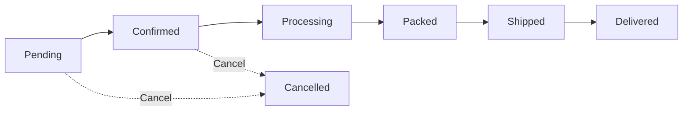

Orders in ShelfWise represent sales transactions that go through a multi-stage fulfillment process. Unlike POS sales which are instant, orders typically involve inventory reservation, picking, packing, and shipping.

## Order Types

ShelfWise supports multiple order types:

- **POS** - Instant in-store sales (see [Point of Sale](/features/sales/point-of-sale))
- **Customer Orders** - E-commerce or phone orders requiring fulfillment
- **Internal** - Stock transfers between locations

## Order Lifecycle

Orders flow through distinct stages with specific inventory implications:



### Order Statuses

| Status | Description | Inventory Impact |
|--------|-------------|------------------|
| **Pending** | Order created, not yet confirmed | None |
| **Confirmed** | Order confirmed, awaiting fulfillment | Stock reserved (not deducted) |
| **Processing** | Order being fulfilled | Stock deducted, reserved quantity cleared |
| **Packed** | Order packed and ready to ship | No change |
| **Shipped** | Order in transit | No change |
| **Delivered** | Order received by customer | No change |
| **Cancelled** | Order cancelled | Reserved stock released |

## Creating Orders

Orders are created through the Orders interface or programmatically via the OrderService:

```php
// OrderService.php:30
public function createOrder(
    Tenant $tenant,
    Shop $shop,
    array $items,
    User $createdBy,
    ?User $customer = null,
    ?string $customerNotes = null,
    ?string $internalNotes = null,
    float $shippingCost = 0,
    ?string $shippingAddress = null,
    ?string $billingAddress = null
): Order {
    return DB::transaction(function () use (
        $tenant, $shop, $items, $createdBy, $customer,
        $customerNotes, $internalNotes, $shippingCost,
        $shippingAddress, $billingAddress
    ) {
        $order = Order::create([
            'tenant_id' => $tenant->id,
            'shop_id' => $shop->id,
            'customer_id' => $customer?->id,
            'status' => OrderStatus::PENDING,
            'payment_status' => PaymentStatus::UNPAID,
            'shipping_cost' => $shippingCost,
            'customer_notes' => $customerNotes,
            'internal_notes' => $internalNotes,
            'shipping_address' => $shippingAddress,
            'billing_address' => $billingAddress,
            'created_by' => $createdBy->id,
        ]);

        $this->createOrderItems($order, $items);
        $order->calculateTotals();
        $order->save();

        return $order;
    });
}
```

### Order Items

Each order contains line items that can be either products or services:

```php
// OrderItem.php:78
public function isProduct(): bool
{
    return $this->sellable_type === ProductVariant::class;
}

public function isService(): bool
{
    return $this->sellable_type === ServiceVariant::class;
}
```

<Note>
Services don't require inventory tracking - only product items interact with stock levels.
</Note>

## Confirming Orders

When an order is confirmed, stock is reserved to prevent overselling:

```php
// OrderService.php:152
public function confirmOrder(Order $order, User $user): Order
{
    return DB::transaction(function () use ($order) {
        foreach ($order->items as $item) {
            if ($item->isProduct()) {
                $variant = $item->productVariant;

                // Use lockForUpdate to prevent race conditions
                $location = $variant->inventoryLocations()
                    ->where('location_type', 'App\\Models\\Shop')
                    ->where('location_id', $order->shop_id)
                    ->lockForUpdate()
                    ->first();

                // Check available stock (quantity - reserved)
                $availableStock = $location->quantity - $location->reserved_quantity;
                if ($availableStock < $item->quantity) {
                    throw new Exception("Insufficient stock for {$variant->sku}");
                }

                // Atomically increment reserved quantity
                $location->increment('reserved_quantity', $item->quantity);
            }
        }

        $order->status = OrderStatus::CONFIRMED;
        $order->confirmed_at = now();
        $order->save();

        return $order;
    });
}
```

<Warning>
**Race Condition Prevention**: Order confirmation uses `lockForUpdate()` and atomic `increment()` to prevent race conditions when multiple orders are confirmed simultaneously for the same product.
</Warning>

## Fulfilling Orders

Order fulfillment moves reserved stock to actual deduction:

```php
// OrderService.php:209
public function fulfillOrder(Order $order, User $user): Order
{
    return DB::transaction(function () use ($order, $user) {
        foreach ($order->items as $item) {
            if ($item->isProduct()) {
                $variant = $item->productVariant;
                $location = $variant->inventoryLocations()
                    ->where('location_type', 'App\\Models\\Shop')
                    ->where('location_id', $order->shop_id)
                    ->first();

                // Clear reservation
                $location->reserved_quantity -= $item->quantity;
                $location->save();

                // Record stock movement for audit trail
                $this->stockMovementService->adjustStock(
                    $variant,
                    $location,
                    $item->quantity,
                    StockMovementType::SALE,
                    $user,
                    "Order #{$order->order_number}",
                    'Fulfilled order item'
                );
            }
        }

        $order->status = OrderStatus::PROCESSING;
        $order->save();

        return $order;
    });
}
```

## Shipping Orders

Mark orders as shipped with tracking information:

<Steps>
  <Step title="Pack the Order">
    Change status to "Packed" to indicate the order is ready for pickup by carrier.

    ```php
    // OrderService.php:320
    public function packOrder(Order $order, User $user): Order
    {
        $order->status = OrderStatus::PACKED;
        $order->packed_at = now();
        $order->packed_by = $user->id;
        $order->save();
        return $order;
    }
    ```
  </Step>

  <Step title="Ship with Tracking">
    Update status to "Shipped" and add tracking information.

    ```php
    // OrderService.php:352
    public function shipOrder(Order $order, User $user, ?array $shippingData = null): Order
    {
        $order->status = OrderStatus::SHIPPED;
        $order->shipped_at = now();
        $order->shipped_by = $user->id;

        if ($shippingData) {
            $order->tracking_number = $shippingData['tracking_number'] ?? null;
            $order->shipping_carrier = $shippingData['carrier'] ?? null;
        }

        $order->save();
        return $order;
    }
    ```
  </Step>

  <Step title="Mark as Delivered">
    Once customer receives the order, mark it delivered.

    ```php
    // OrderService.php:401
    public function deliverOrder(Order $order, User $user, ?string $notes = null): Order
    {
        $order->status = OrderStatus::DELIVERED;
        $order->delivered_at = now();
        $order->delivered_by = $user->id;
        $order->save();
        return $order;
    }
    ```
  </Step>
</Steps>

## Cancelling Orders

Cancelling orders releases reserved inventory:

```php
// OrderService.php:266
public function cancelOrder(Order $order, User $user, ?string $reason = null): Order
{
    return DB::transaction(function () use ($order, $user, $reason) {
        // If order was confirmed, release reserved stock
        if ($order->status === OrderStatus::CONFIRMED) {
            foreach ($order->items as $item) {
                if ($item->isProduct()) {
                    $location = $variant->inventoryLocations()
                        ->where('location_type', 'App\\Models\\Shop')
                        ->where('location_id', $order->shop_id)
                        ->lockForUpdate()
                        ->first();

                    if ($location) {
                        // Atomically decrement reserved quantity
                        $location->decrement('reserved_quantity', $item->quantity);
                    }
                }
            }
        }

        $order->status = OrderStatus::CANCELLED;
        $order->internal_notes = ($order->internal_notes ? $order->internal_notes."\n\n" : '').
            "Cancelled by {$user->name} at ".now()->format('Y-m-d H:i:s').
            ($reason ? "\nReason: {$reason}" : '');
        $order->save();

        return $order;
    });
}
```

<Note>
Only orders in `PENDING` or `CONFIRMED` status can be cancelled. Once fulfilled, use the [returns process](/features/sales/returns) instead.
</Note>

## Payment Tracking

Orders track payment status independently of fulfillment status:

### Payment Statuses

- **Unpaid** - No payment received
- **Partial** - Partial payment received
- **Paid** - Fully paid
- **Refunded** - Payment refunded
- **Failed** - Payment failed

```php
// Order.php:298
public function updatePaymentStatus(): void
{
    if ($this->paid_amount >= $this->total_amount) {
        $this->payment_status = PaymentStatus::PAID;
    } elseif ($this->paid_amount > 0) {
        $this->payment_status = PaymentStatus::PARTIAL;
    } else {
        $this->payment_status = PaymentStatus::UNPAID;
    }
}
```

### Recording Payments

Payments are recorded as separate `OrderPayment` records:

```php
$payment = OrderPayment::create([
    'order_id' => $order->id,
    'tenant_id' => $order->tenant_id,
    'shop_id' => $order->shop_id,
    'amount' => $amount,
    'payment_method' => 'card',
    'payment_date' => now(),
    'reference_number' => 'TXN-123456',
    'recorded_by' => auth()->id(),
]);
```

## Order Numbers

Orders automatically receive sequential numbers using a date-based format:

```php
// Order.php:258
public static function generateOrderNumber(int $tenantId, $createdAt = null): string
{
    $creationDate = $createdAt ? Carbon::parse($createdAt) : now();
    $prefix = 'ORD';
    $date = $creationDate->format('Ymd');

    // Get max sequence for today with row locking
    $lastOrder = self::where('tenant_id', $tenantId)
        ->whereDate('created_at', $creationDate)
        ->orderBy('id', 'desc')
        ->lockForUpdate()
        ->first();

    $sequence = $lastOrder ? (int) substr($lastOrder->order_number, -4) : 0;
    $sequence++;

    return sprintf('%s-%s-%04d', $prefix, $date, $sequence);
}
```

Example: `ORD-20240304-0001`

## Editing Orders

Orders can only be edited in certain statuses:

```php
// Order.php:220
public function canEdit(): bool
{
    return $this->status->canEdit();
}
```

Typically, only `PENDING` orders can be edited. Confirmed or fulfilled orders require cancellation and recreation.

## Order Calculations

Order totals are calculated from line items:

```php
// Order.php:250
public function calculateTotals(): void
{
    $this->subtotal = $this->items->sum(fn ($item) => $item->unit_price * $item->quantity);
    $this->tax_amount = $this->items->sum('tax_amount');
    $this->discount_amount = $this->items->sum('discount_amount');
    $this->total_amount = $this->subtotal + $this->tax_amount - $this->discount_amount + $this->shipping_cost;
}
```

Line item totals are calculated with:

```php
// OrderItem.php:88
public function calculateTotal(): void
{
    $subtotal = $this->unit_price * $this->quantity;
    $this->total_amount = $subtotal + $this->tax_amount - $this->discount_amount;
}
```

## Product Packaging

Order items support product packaging types (cases, pallets, etc.):

```php
// OrderService.php:487
if (isset($item['product_packaging_type_id'])) {
    $packagingType = ProductPackagingType::find($item['product_packaging_type_id']);

    if ($packagingType) {
        if (isset($item['package_quantity'])) {
            // Convert package quantity to unit quantity
            $quantity = $item['package_quantity'] * $packagingType->units_per_package;
        }

        // Use package pricing
        $unitPrice = $packagingType->price / $packagingType->units_per_package;
        $packagingDescription = $packagingType->display_name ?? $packagingType->name;
    }
}
```

This allows selling products by case or pallet while tracking inventory in base units.

## Querying Orders

The Order model provides helpful query scopes:

```php
// Filter by tenant (always required)
Order::query()->forTenant($tenantId)->get();

// Filter by shop
Order::query()->forShop($shopId)->get();

// Filter by status
Order::query()->withStatus(OrderStatus::CONFIRMED)->get();

// Get only POS sales
Order::query()->posSales()->get();

// Get customer orders
Order::query()->customerOrders()->get();

// Get active orders (not delivered/cancelled)
Order::query()->active()->get();
```

## Best Practices

<Steps>
  <Step title="Confirm Orders Promptly">
    Confirm orders as soon as you can fulfill them to reserve stock and prevent overselling.
  </Step>

  <Step title="Use Status Transitions Correctly">
    Follow the proper status flow: Pending → Confirmed → Processing → Packed → Shipped → Delivered.
  </Step>

  <Step title="Record Payments">
    Keep payment status updated independently of fulfillment status for accurate financial reporting.
  </Step>

  <Step title="Add Tracking Information">
    Always include tracking numbers when shipping to reduce customer support inquiries.
  </Step>

  <Step title="Use Internal Notes">
    Document important information in internal notes (not visible to customers).
  </Step>
</Steps>

## Related Resources

- [Point of Sale](/features/sales/point-of-sale) - Process instant in-store sales
- [Returns](/features/sales/returns) - Handle order returns and refunds
- [Stock Movements](/features/inventory/stock-movements) - View stock movements and audit trail