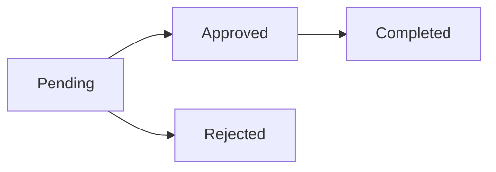

The ShelfWise returns system handles customer returns with flexible options for restocking inventory and processing refunds. Returns support partial quantities, multiple items, and detailed reason tracking.

## Overview

Returns in ShelfWise:

- Support full or partial order returns
- Track return reasons and item conditions
- Optional inventory restocking
- Automatic or manual refund processing
- Complete audit trail with approval workflow

## Return Eligibility

Only orders in specific statuses can be returned:

```php
// OrderReturnService.php:32
if (!in_array($order->status->value, ['delivered', 'completed'])) {
    throw new Exception('Only delivered or completed orders can be returned');
}
```

<Note>
Pending or in-transit orders should be cancelled rather than returned. See [Cancelling Orders](/features/sales/orders#cancelling-orders).
</Note>

## Creating a Return

Returns are created with specific items, quantities, and reasons:

<Steps>
  <Step title="Select Order">
    Navigate to a delivered order and click "Create Return" or use the returns interface.
  </Step>

  <Step title="Choose Items and Quantities">
    Select which items to return and specify quantities. You can return:
    - Full quantities of some items
    - Partial quantities
    - Any combination of order items

    ```php
    // OrderReturnService.php:25
    public function createReturn(
        Order $order,
        User $user,
        array $items, // ['order_item_id' => ['quantity' => int, 'reason' => string]]
        string $reason,
        ?string $notes = null
    ): OrderReturn
    ```
  </Step>

  <Step title="Provide Return Reason">
    Enter a reason for the return (required) and optional notes about item condition.

    ```php
    foreach ($items as $orderItemId => $itemData) {
        if ($itemData['quantity'] > $orderItem->quantity) {
            throw new Exception("Return quantity cannot exceed ordered quantity");
        }

        $return->items()->create([
            'order_item_id' => $orderItemId,
            'quantity' => $itemData['quantity'],
            'reason' => $itemData['reason'] ?? null,
            'condition_notes' => $itemData['condition_notes'] ?? null,
        ]);
    }
    ```
  </Step>

  <Step title="Submit for Approval">
    The return is created with `PENDING` status and assigned a unique return number.

    ```php
    $returnNumber = 'RET-' . strtoupper(uniqid());

    $return = OrderReturn::create([
        'tenant_id' => $order->tenant_id,
        'order_id' => $order->id,
        'customer_id' => $order->customer_id,
        'return_number' => $returnNumber,
        'status' => 'pending',
        'reason' => $reason,
        'notes' => $notes,
        'created_by' => $user->id,
    ]);
    ```
  </Step>
</Steps>

## Return Workflow

Returns flow through an approval process:



### Return Statuses

| Status | Description | Inventory Impact |
|--------|-------------|------------------|
| **Pending** | Return requested, awaiting approval | None |
| **Approved** | Return approved, refund/restock processed | Stock added back (if restocking) |
| **Rejected** | Return rejected | None |
| **Completed** | Return finalized | No change |

## Approving Returns

When approving a return, you can choose to restock items and process refunds:

```php
// OrderReturnService.php:94
public function approveReturn(
    OrderReturn $return,
    User $user,
    bool $restockItems = true,
    bool $processRefund = true
): OrderReturn {
    return DB::transaction(function () use ($return, $user, $restockItems, $processRefund) {
        $refundAmount = 0;

        // Restock items if requested
        if ($restockItems) {
            foreach ($return->items as $returnItem) {
                $orderItem = $returnItem->orderItem;

                if ($orderItem->isProduct()) {
                    $variant = $orderItem->productVariant;
                    $location = $variant->inventoryLocations()
                        ->where('location_type', 'App\\Models\\Shop')
                        ->where('location_id', $return->order->shop_id)
                        ->first();

                    if ($location) {
                        // Add stock back (negative quantity adds stock)
                        $this->stockMovementService->adjustStock(
                            $variant,
                            $location,
                            -$returnItem->quantity,
                            StockMovementType::RETURN,
                            $user,
                            "Return #{$return->return_number}",
                            "Restocked from approved return. Reason: {$return->reason}"
                        );
                    }
                }

                // Calculate refund amount
                $refundAmount += ($orderItem->unit_price * $returnItem->quantity);
            }

            $return->restocked = true;
        }

        // Process refund if requested
        if ($processRefund && $refundAmount > 0) {
            $this->refundService->partialRefund(
                $return->order,
                $user,
                $return->items->mapWithKeys(function ($item) {
                    return [$item->order_item_id => $item->quantity];
                })->toArray(),
                "Return #{$return->return_number}: {$return->reason}",
                false // Don't restock again
            );
        }

        // Update return status
        $return->status = 'approved';
        $return->approved_by = $user->id;
        $return->approved_at = now();
        $return->refund_amount = $refundAmount;
        $return->save();

        return $return;
    });
}
```

<Steps>
  <Step title="Review Return Request">
    Check the return reason, item conditions, and return quantities.
  </Step>

  <Step title="Decide on Restocking">
    Choose whether to add items back to inventory:
    - **Yes** - Items are sellable and should be restocked
    - **No** - Items are damaged or unsellable
  </Step>

  <Step title="Process Refund">
    Choose whether to issue a refund:
    - **Yes** - Customer receives refund for returned items
    - **No** - No refund issued (e.g., for store credit)
  </Step>

  <Step title="Approve">
    Click approve to process the return with your selections.
  </Step>
</Steps>

## Rejecting Returns

Returns can be rejected if they don't meet return policy criteria:

```php
// OrderReturnService.php:183
public function rejectReturn(
    OrderReturn $return,
    User $user,
    ?string $rejectionReason = null
): OrderReturn {
    return DB::transaction(function () use ($return, $user, $rejectionReason) {
        $return->status = 'rejected';
        $return->rejected_by = $user->id;
        $return->rejected_at = now();

        if ($rejectionReason) {
            $return->notes = ($return->notes ? $return->notes . "\n\n" : '') .
                "Rejection Reason: {$rejectionReason}";
        }

        $return->save();
        return $return;
    });
}
```

Provide a clear rejection reason that will be visible to the customer.

## Partial Returns

You can return partial quantities of items:

```php
// Example: Return 3 out of 10 units ordered
$items = [
    $orderItemId => [
        'quantity' => 3,  // Returning 3 units
        'reason' => 'Defective',
        'condition_notes' => '3 units have manufacturing defects'
    ]
];

$return = $orderReturnService->createReturn(
    order: $order,
    user: auth()->user(),
    items: $items,
    reason: 'Product defects',
    notes: 'Customer willing to keep remaining 7 units'
);
```

This is useful when:
- Only some units in a multi-unit order are defective
- Customer wants to keep some items
- Partial refunds are being issued

## Inventory Impact

Returns interact with inventory in specific ways:

### Restocking Returns

When restocking is enabled, items are added back to the shop's inventory:

```php
// Negative quantity = add stock back
$this->stockMovementService->adjustStock(
    $variant,
    $location,
    -$returnItem->quantity,  // Negative to add back
    StockMovementType::RETURN,
    $user,
    "Return #{$return->return_number}",
    "Restocked from approved return"
);
```

This creates a stock movement record of type `RETURN` in the audit trail.

### Non-Restocking Returns

When restocking is disabled:
- No inventory is added back
- Stock movement is not recorded
- Useful for damaged or unsellable items
- Refund can still be processed

<Warning>
**Important**: Returns do NOT automatically restock inventory. You must explicitly approve the return with the `restockItems` flag set to `true`.
</Warning>

## Refund Processing

Refunds are calculated based on the original unit price:

```php
// Calculate refund amount per item
$refundAmount += ($orderItem->unit_price * $returnItem->quantity);
```

The refund amount:
- Uses the original sale price
- Multiplies by returned quantity
- Includes tax if applicable
- Excludes discounts that applied to non-returned items

### Refund Methods

Refunds are processed through the OrderRefundService:

```php
$this->refundService->partialRefund(
    $return->order,
    $user,
    $itemQuantities,
    $reason,
    $restock = false  // Already restocked in return approval
);
```

The refund is recorded against the original order and payment records are updated.

## Completing Returns

After approval and refund processing, mark the return as completed:

```php
// OrderReturnService.php:226
public function completeReturn(
    OrderReturn $return,
    User $user
): OrderReturn {
    return DB::transaction(function () use ($return, $user) {
        $return->status = 'completed';
        $return->completed_by = $user->id;
        $return->completed_at = now();
        $return->save();

        return $return;
    });
}
```

Completed returns:
- Cannot be modified
- Are included in return rate reports
- Maintain full audit trail

## Return Numbers

Each return receives a unique identifier:

```php
$returnNumber = 'RET-' . strtoupper(uniqid());
```

Example: `RET-65E8F3A2B9C41`

This ensures every return can be tracked and referenced uniquely.

## Checking Return Status

The OrderReturn model provides status check methods:

```php
// OrderReturn.php:93
public function isPending(): bool
{
    return $this->status === OrderReturnStatus::PENDING;
}

public function isApproved(): bool
{
    return $this->status === OrderReturnStatus::APPROVED;
}

public function isRejected(): bool
{
    return $this->status === OrderReturnStatus::REJECTED;
}

public function isCompleted(): bool
{
    return $this->status === OrderReturnStatus::COMPLETED;
}
```

Use these methods to control UI and business logic based on return state.

## Return Reasons

Common return reasons to track:

- **Defective** - Product has defects or doesn't work
- **Wrong Item** - Incorrect item shipped
- **Not as Described** - Product doesn't match description
- **Changed Mind** - Customer no longer wants item
- **Size/Fit** - Item doesn't fit
- **Damaged in Shipping** - Item arrived damaged
- **Quality Issues** - Poor quality
- **Other** - Other reasons with notes

Tracking detailed reasons helps:
- Identify quality issues
- Improve product descriptions
- Track supplier problems
- Generate return analytics

## Best Practices

<Steps>
  <Step title="Define Clear Return Policies">
    Establish and communicate return windows, restocking fees, and eligible items.
  </Step>

  <Step title="Inspect Items Before Restocking">
    Only restock items that are in resellable condition.
  </Step>

  <Step title="Track Return Reasons">
    Use consistent reason codes and notes to identify trends.
  </Step>

  <Step title="Process Returns Promptly">
    Quick return processing improves customer satisfaction and inventory accuracy.
  </Step>

  <Step title="Document Condition">
    Use the condition notes field to document item state for future reference.
  </Step>

  <Step title="Separate Refund and Restock Decisions">
    You can restock without refunding, or refund without restocking, based on your policies.
  </Step>
</Steps>

## Related Resources

- [Orders](/features/sales/orders) - View original orders for returns
- [Stock Movements](/features/inventory/stock-movements) - View return stock movements and audit trail